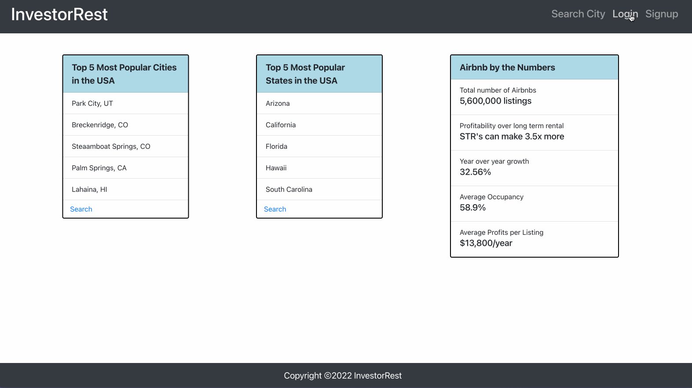
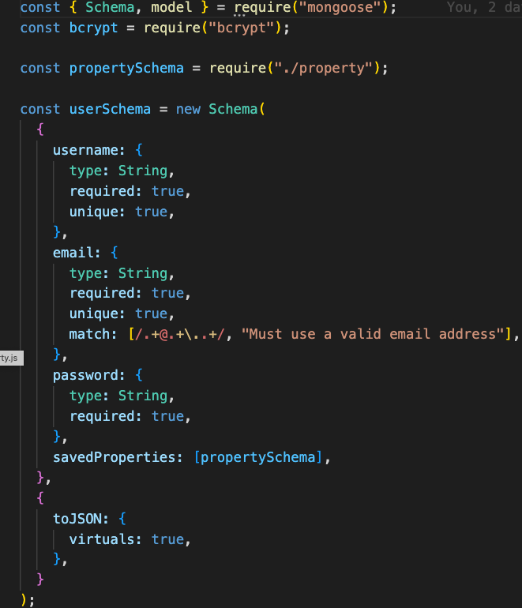
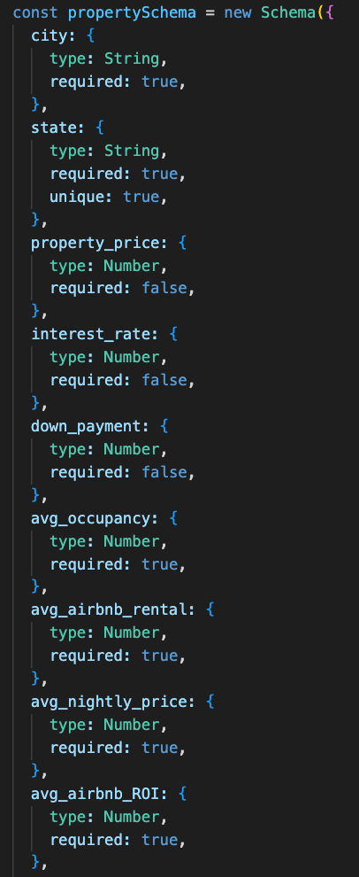
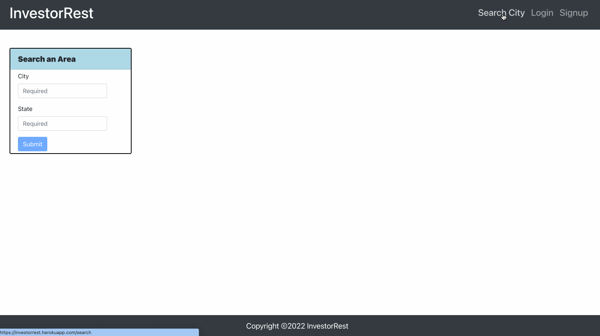
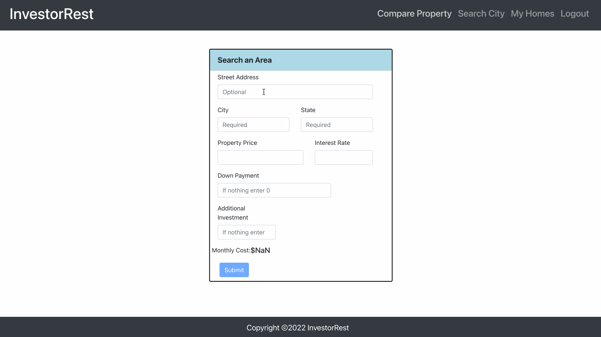
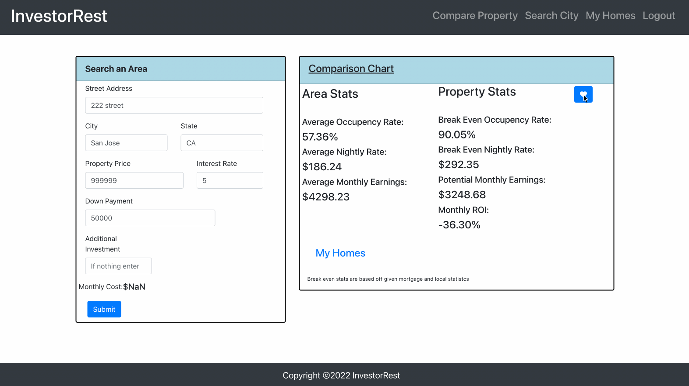
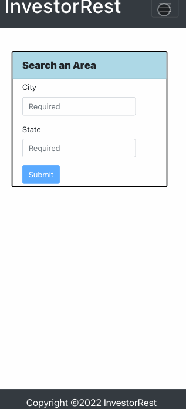
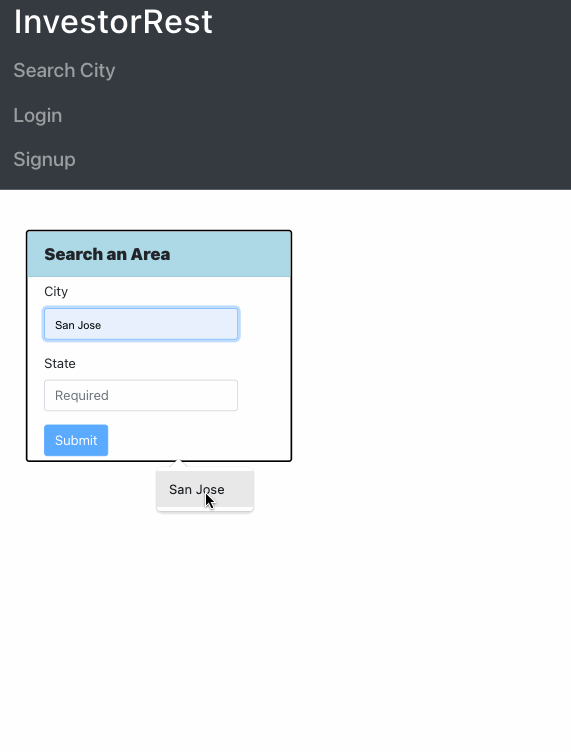
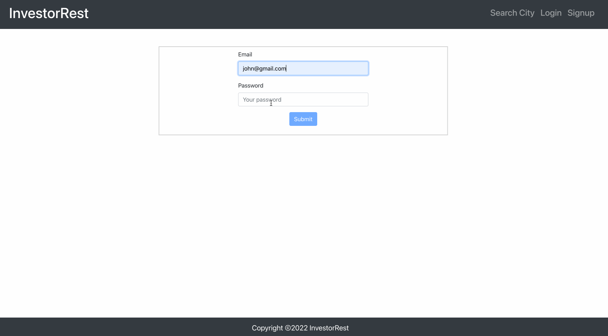
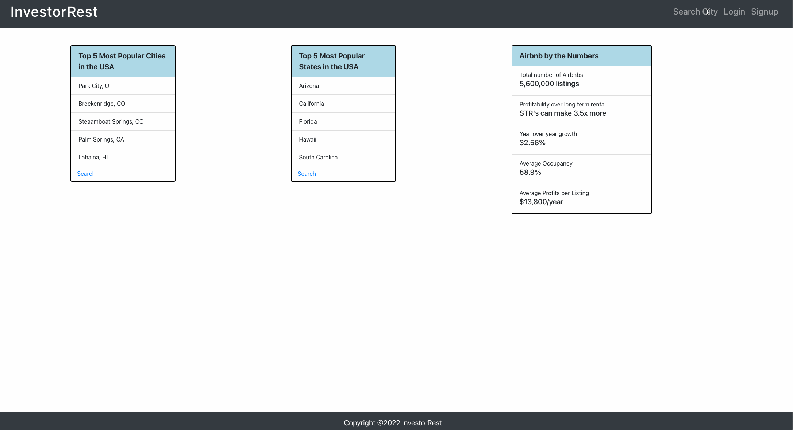

# InvestorRest

## Description

InvestorRest is an application which helps users to look for the Airbnb investment properties based on a location. They can search the Airbnb properties data based on the city and state and analyze the inverstment to make a decision of investing in that property.

Users can also compare a property to the Airbnb stats of that area and calculate the mortgage of the property. User can save the properties and make a favorites list to evaluate further.

## Deployed Link & Preview

Here is the link to the [deployed application](https://investorrest.herokuapp.com/)

Here is the demo screenshot of the deployed application 

## Why?

We wanted to create an user-friendly and mobile responsive application for the users to analyze and invest in Airbnb properties.

Airbnb is a booming business and predicted to take over traditional rentals as well. Investing is more than just can you afford it, it is also about location and the areas point of view on Airbnb. Everyone is in this to make money but how much is critical to what you can do with that property.

### Features

- Easy to use
- Provide options to the user to search, add, update and delete a property.
- Generates a responsive webpage

## Table of Contents

- [Installation](#installation)
- [Usage](#usage)
- [Technologies Used](#technologies-used)
- [Models and Relationships](#models-and-relationships)
- [API Routes](#api-routes)
- [User Stories](#user-stories)
- [CSS Framework](#css-framework)
- [Learning Objectives](#learning-objectives)
- [Collaborators](#collaborators)
- [License](#license)

## Installation

- Create a new repository on your GitHub account.
- Clone this repository.
- Run `npm install`
- Run `npm run develop`

## Usage

This project can be used in any web browser or on any devices including the mobile devices.

Following is a code snippet of the application page.

Here it refers to the POST request for saving a Airbnb property to the favorites by the user.

```Node.js

async saveProperty({ user, body }, res) {
    console.log(user);
    try {
      const updatedUser = await User.findOneAndUpdate(
        { _id: user._id },
        { $addToSet: { savedProperties: body } }
      );
      res.json(updatedUser);
    } catch (err) {
      console.log(err);
      return res.status(400).json(err);
    }
  },

```

## Technologies Used

- HTML
- SCSS
- React-Bootstrap
- Bootstrap
- JavaScript
- React
- Axios
- Node.js
- Express.js
- Mongoose
- Heroku

## Models and Relationships

Basic models are below. Properties belong to the User.




## API Routes

Below are example calls made to the API routes.

User-routes

```Node.js

// api/users/login
router.route('/login').post(login);
// api/users
router.route('/').post(createUser).put(authMiddleware, saveProperty);

```

Home-routes

```Node.js

// save property route
router.route("/save").post(authMiddleware, saveProperty);
// get saved properties route
router.route("/").get(authMiddleware, getSavedProperties);
// delete saved properties route
router.route("/:id").delete(authMiddleware, deleteProperty);

```

## User Stories

- As a user, I want to search a city, to get the investment details as per the location/city

  

- As a user, I want to search properties to compare, to know the details like occupancy rate, total number of properties for futher evaluation

  

- As a user, I want to search a location, to view that location on a map

  

- As a user, I want to save the properties to favorites, to view and evaluate the properties further

  

- As a user, I want to have login/signup credentials , to view and compare the properties and save the favorite properties.

  

## CSS Framework

### SCSS Framework

### Gif of site at different screen sizes

Mobile version of the app



IPad version of the app



Desktop version of the app



Large screen version of the app



## Learning Objectives

Major learning objectives for this project were

- Gain a better understanding on the Full stack application development with MERN stack
- Server calls involving backend queries on models
- Single and multiple page navigation
- Learn more about how to get the data from 3rd party apis to fetch a response and parse through the response for the necessary information to incorperate into our web application.

## Collaborators

- Jack McWilliams, GitHub [https://github.com/Mrwaynejames]
- Swetha Pothuganti, GitHub [https://github.com/shwethareddy0]
- Aaron Socher, GitHub [https://github.com/AMESocker]
- Orlando Lopez, GitHub [https://github.com/OrlandoZL]

## License

This project is licensed under the [MIT](./LICENSE) license.
